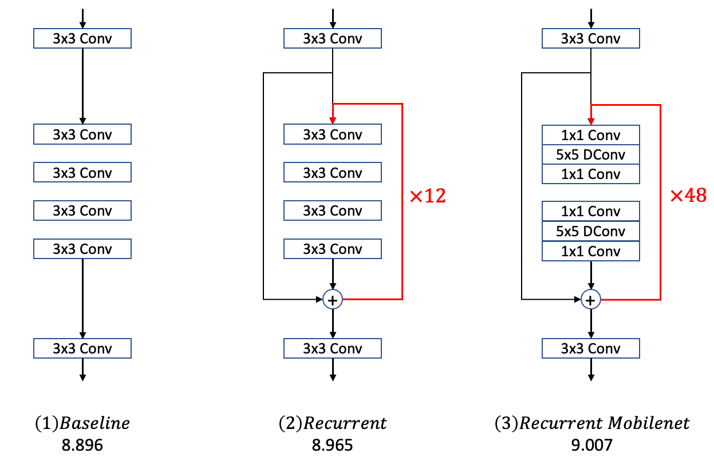

## Recurrent MobileNet for MegCup 2022
We (IIL2) propose Recurrent MobileNet for light parameters raw image denoising. Our code
is based on Pytorch, we also convert model weights to MegEngine for inference.



#### Environment
```
conda env create -f requirements.yaml
conda activate recurrent_mobilenet
```

#### Check Params
Number of parameters of the model is restrict to 100k. To check the number of
parameters, you could run each file in `models` directory.

```
cd models
python recurrent_mobilenet.py
```

#### Testing
```
cd test_models
python test.py --path path_to_dataset
```

it should generate a `result.bin` to current directory. The `path_to_dataset` is organized
the same as downloaded:
```
path_to_dataset
|--burst_raw
   |--competition_train_input.0.2.bin
   |--competition_train_gt.0.2.bin
   |--competition_test_input.0.2.bin
```

#### (Validating)
We also divide the last 1024 pairs in the training set as our validation set, you can 
also validate on our dataset.
```
cd validate_models
python validate.py --path path_to_dataset
```

#### Training
```
cd train_models
python distributed_train.py --path path_to_dataset --worldsize 8
```